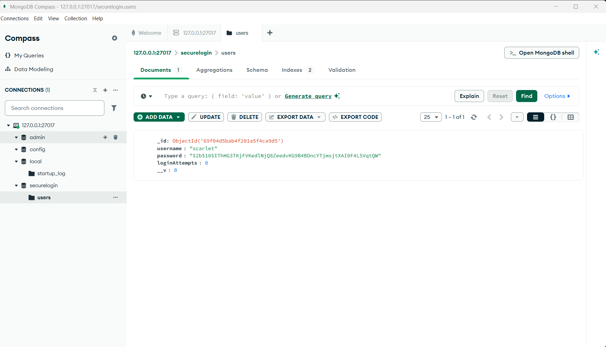
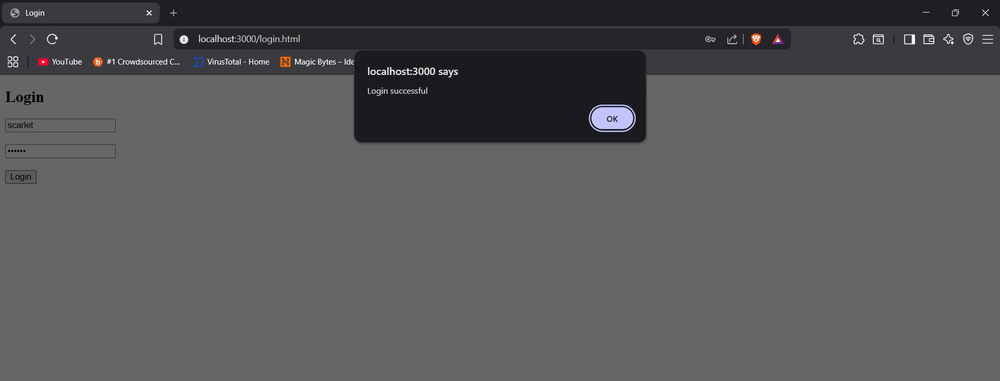
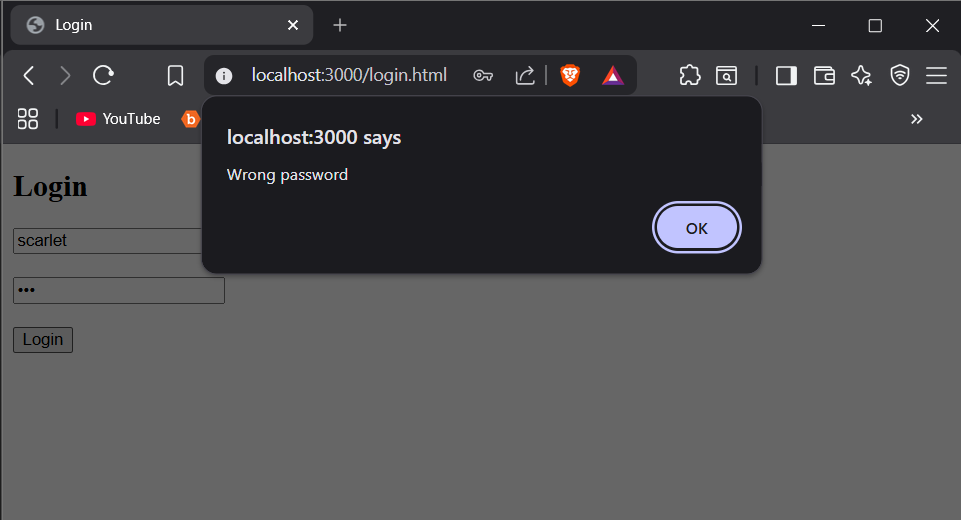
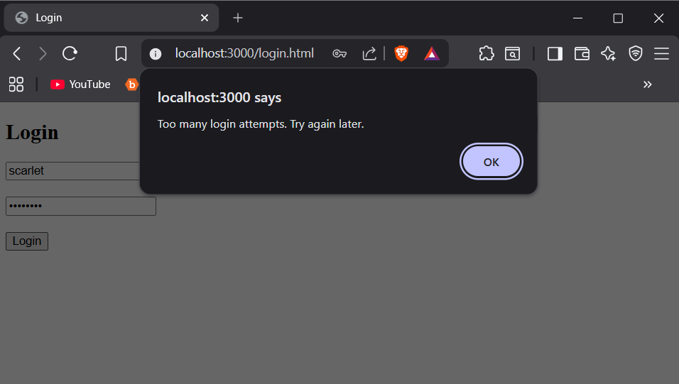
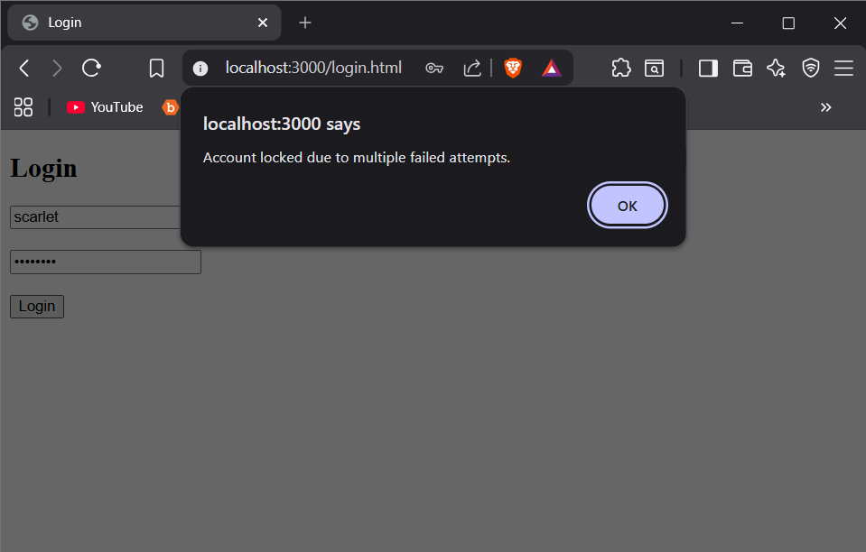
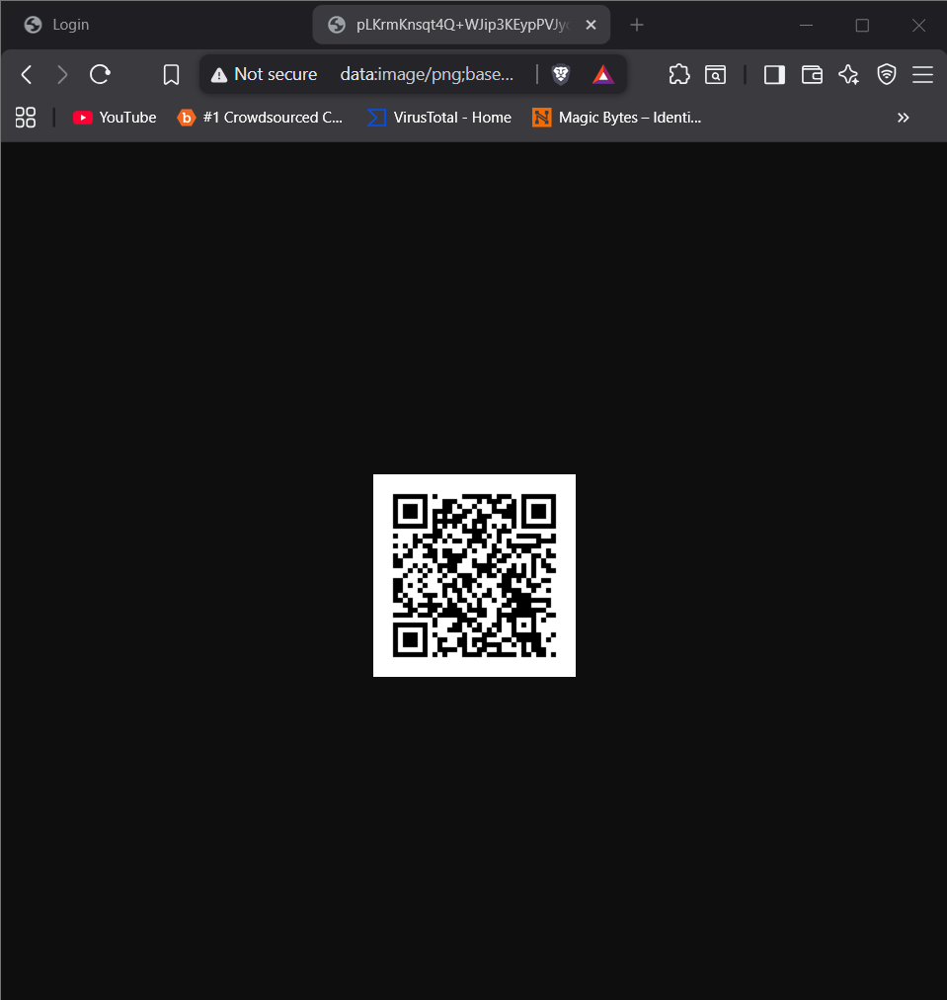
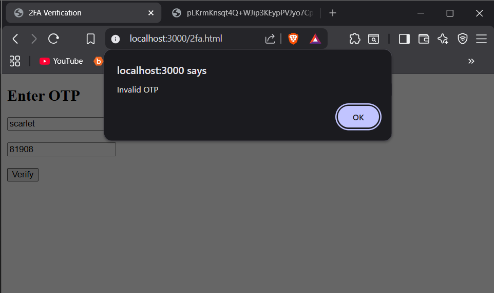
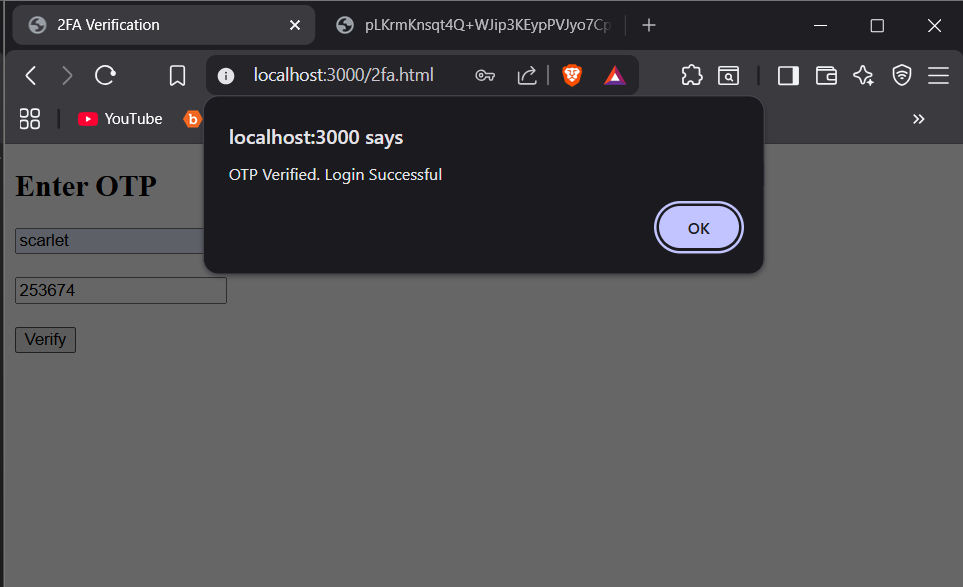

# Secure Login System

## Overview

This project implements a **secure authentication system** using Node.js with protections against brute-force and credential stuffing attacks. It includes password hashing, rate limiting, account lockout, and TOTP-based 2FA.

---

## Features

* Password hashing using bcrypt
* Rate limiting (express-rate-limit)
* Account lockout after failed attempts
* TOTP-based 2FA using speakeasy
* QR code generation
* OTP verification

---

## Tech Stack

* Node.js
* Express.js
* MongoDB
* bcrypt
* speakeasy
* qrcode
* express-rate-limit

---

## How to Run

1. Install dependencies:

   ```
   npm install
   ```

2. Start the server:

   ```
   node server.js
   ```

3. Open in browser:

   ```
   http://localhost:3000/login.html
   ```

---

## Steps Implemented

### 1. Secure Password Storage

Passwords are hashed using bcrypt before storing in MongoDB.

---

### 2. Credential Stuffing Attack Simulation

Multiple incorrect login attempts were made using common passwords to simulate a credential stuffing attack.

---

### 3. Rate Limiting

Maximum 5 login attempts per minute are allowed using express-rate-limit.

---

### 4. Account Lockout

After 5 failed attempts, the account is locked for 2 minutes to prevent further attacks.

---

### 5. Two-Factor Authentication (2FA)

* QR code is generated for the user
* Scanned using Microsoft Authenticator
* OTP verification successfully implemented

---

### 6. Replay Attack Protection

OTP is time-based (valid for 30 seconds).
Old OTP cannot be reused, preventing replay attacks.

---

## Attack Documentation

### Before Security Measures

* Unlimited login attempts were possible
* System was vulnerable to brute-force and credential stuffing

### After Security Measures

* Rate limiting restricts repeated attempts
* Account lockout activates after 5 failures
* 2FA adds an additional security layer
* Attack is successfully mitigated

---

## Screenshots

### Hashed Password in Database



---

### Successful Login



---

### Wrong Password Attempt



---

### Rate Limiting Triggered



---

### Account Lockout



---

### QR Code for 2FA



---

### Invalid OTP



---

### OTP Verified Successfully



---

## Conclusion

The system successfully prevents brute-force and credential stuffing attacks using:

* bcrypt password hashing
* rate limiting
* account lockout
* two-factor authentication

This ensures a secure login mechanism.

---
